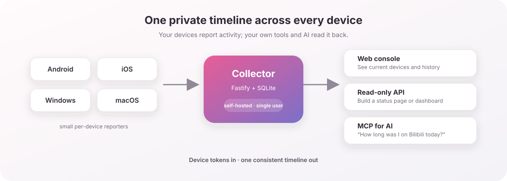

<div align="center">


[](https://github.com/asashiki)

</div>

# device-timeline-mcp

> **English** | [中文](README.zh-CN.md)

**See what app you are using across every device—right now or earlier—and let your AI answer questions about it.**

This self-hosted, single-user service collects activity from **Android, iOS, Windows, and macOS** into one SQLite timeline. Read it three ways:

- a **read-only HTTP API** (for your own status pages / frontends),
- a **web console** for eyeballing the data,
- an **MCP server** so an AI assistant (Claude Desktop, Claude Code, …) can answer "what is he doing right now?" / "how much time on B站 today?".

No account system: run one collector and give each device its own token.

---

## How it fits together



The **collector** runs on a server (Docker). The **MCP server** is a thin stdio
process you run wherever your AI client lives; it just calls the collector's
read API.

---

## Quick start (Docker)

```bash
git clone <this-repo> device-timeline-mcp
cd device-timeline-mcp
cp .env.example .env
# edit .env → generate a token per device (see below)
docker compose up -d --build
```

Open `http://<host>:4823/console` — you should see your devices appear as they
start reporting. Health check: `curl http://<host>:4823/health`.

### Without Docker (Node ≥ 22.5)

```bash
npm install
cp .env.example .env   # edit it
npm run build && npm start      # or: npm run dev
```

> **Why Node 22.5+?** The collector uses Node's built-in `node:sqlite` — no
> native module to compile.

---

## Device tokens & multi-device naming

Every device authenticates with its own token. Define them in `.env` under
`DEVICE_TOKENS_JSON` (or point `DEVICE_TOKENS_FILE` at a JSON file).

```jsonc
[
  {"token":"<openssl rand -hex 32>","deviceId":"android-phone","deviceName":"我的手机","platform":"android"},
  {"token":"<openssl rand -hex 32>","deviceId":"android-tablet","deviceName":"平板 Y700","platform":"android"},
  {"token":"<openssl rand -hex 32>","deviceId":"windows-pc","deviceName":"台式机","platform":"windows"},
  {"token":"<openssl rand -hex 32>","deviceId":"mac-laptop","deviceName":"MacBook","platform":"macos"},
  {"token":"<openssl rand -hex 32>","deviceId":"ios-phone","deviceName":"iPhone","platform":"ios"}
]
```

**The key idea for "two of the same platform":** devices are told apart by
**`deviceId`**, *not* by platform. If you have an Android **phone** and an
Android **tablet** (like a typical setup), give them **different `deviceId`s** —
e.g. `android-phone` and `android-tablet` — each with its **own token**. They
both have `platform: "android"` and both land in the same tables; every query
can filter by `deviceId`, and the console shows them as separate cards.

- `deviceId`: kebab-case, unique, stable. This is the join key — don't change it later.
- `deviceName`: free-form display label (shown in the console / MCP output).
- Generate each token with `openssl rand -hex 32`.

---

## Per-platform reporter setup

The reporters live in [`reporters/`](reporters/) — each has its own README with build +
setup steps:

| platform | source | notes |
|---|---|---|
| Android | [`reporters/android`](reporters/android) | timeline-only Kotlin app (foreground service) |
| Windows | [`reporters/windows`](reporters/windows) | .NET tray app, single-file exe |
| macOS | [`reporters/macos`](reporters/macos) | Python + launchd daemon |
| iOS | [`reporters/ios`](reporters/ios) | Shortcuts automations (no installable app) |

The desktop/Android reporters do the same thing: sample the foreground app + window
title every ~10s and `POST /api/devices/report` with their Bearer token. All you
configure is the **server URL** and the device **token**.

### Android (phone & tablet)

Build the APK from [`reporters/android`](reporters/android) (Android Studio or
`./gradlew assembleRelease`), then:

1. Install the APK on the device.
2. Open it once → grant **Usage Access** (设置 → 应用 → 特殊权限 → 使用情况访问) and
   disable battery optimization for it (so it keeps reporting in the background).
3. In the app's settings, set:
   - **Server URL**: `https://<your-host>` (or `http://host:4823` on LAN)
   - **Token**: the token for this device
4. For a **phone + tablet**, install on both, and paste the **phone token** on the
   phone and the **tablet token** on the tablet. That's the whole distinction.

### iOS — Shortcuts automations

iOS has no background reporter; you drive it with two **Personal Automations** in the
**Shortcuts** app.

**A. "App Opened" automation** (fires when you open any tracked app):

- New Automation → **App** → choose the apps to track → **Is Opened**.
- Action: **Get Contents of URL** → `POST https://<host>/api/devices/ios/app-event`
  with header `Authorization: Bearer <ios token>` and JSON body
  `{"app":"<App Name>","action":"open"}`.
- Turn **off** "Ask Before Running".


**B. "App Closed" automation** — same as above with `"action":"close"`.


See [`reporters/ios`](reporters/ios) for the full Shortcuts walkthrough and the
`/api/devices/ios/app-event` body shape.

### Windows

1. Drop the reporter `.exe` on the machine (single-file, self-contained).
2. First run → tray icon → **Settings**:
   - **Server URL**: `https://<host>`
   - **Token**: the `windows-pc` token
3. Enable **Start with Windows** (writes an `HKCU\…\Run` entry).

### macOS

1. `pip3 install -r requirements.txt` (or use the packaged build once ported).
2. Grant **Accessibility** permission to the terminal/app running it
   (System Settings → Privacy & Security → Accessibility) — needed to read window titles.
3. Edit `config.json` → `serverUrl` + `token` (the `mac-laptop` token).
4. Install as a launchd agent for auto-start (see `reporters/macos` after port).

---

## Connect an MCP client

There are two ways to connect, depending on whether your AI client runs the MCP
server locally (stdio) or connects to a remote URL (HTTP).

### A. Local clients — stdio (Claude Desktop, Claude Code)

Run the bundled stdio MCP server where your client lives, pointed at the
collector:

```jsonc
// Claude Desktop: claude_desktop_config.json
{
  "mcpServers": {
    "device-timeline": {
      "command": "node",
      "args": ["/abs/path/device-timeline-mcp/dist/mcp/server.js"],
      "env": { "MCP_API_BASE": "https://<your-host>" }
    }
  }
}
```

### B. Remote clients — HTTP / `/mcp` (claude.ai, web)

The collector also serves a **streamable-HTTP MCP endpoint** at `/mcp` (same
service, same port — no extra process). Web clients like **claude.ai** can't use
stdio; they connect to a URL instead. Point your client's custom/remote MCP
connector at:

```
https://<your-domain>/mcp
```

- You bring your own domain: put the collector behind HTTPS (a reverse proxy /
  tunnel of your choice) and add it as a remote MCP connector in your client.
- claude.ai requires an **HTTPS** URL — a bare `http://IP:port` won't be
  accepted, so the reverse proxy is what makes this work.
- The endpoint is **unauthenticated by default** (it exposes your own activity).
  Either keep it behind something only you can reach, or set `MCP_HTTP_TOKEN` to
  require an `Authorization: Bearer <token>` header. Set `MCP_HTTP_ENABLED=false`
  to turn the endpoint off entirely.

Tools exposed (identical for both transports):

| tool | what it answers |
|---|---|
| `device_status` | what every device is doing right now (online, foreground app, battery) |
| `device_timeline` | chronological activity for a day (filterable by `deviceId`) |
| `device_activity_summary` | per-app screen-time totals for a day |

---

## Read API (for your own frontends)

CORS is enabled (`CORS_ORIGIN`, default `*`). All timestamps are **UTC ISO**;
`date=` means a calendar day in `DISPLAY_TZ` (default `Asia/Shanghai`).

| endpoint | purpose |
|---|---|
| `GET /health` | liveness + schema version |
| `GET /api/devices/current` | latest state per device (+ `appName`, `live` text) |
| `GET /api/devices/timeline-query?date=&deviceId=&limit=` | activity list |
| `GET /api/devices/activity-summary?date=&deviceId=` | per-app totals |
| `GET /api/app-labels` | the raw appId → {name, desc} map |
| `GET /api/devices/health/summary?hours=&deviceId=` | health summary (per-metric sum/min/max/avg + latest) |
| `GET /api/devices/health/records?type=&hours=&deviceId=&limit=` | raw samples of one health metric (newest first) |
| `POST /api/devices/report` | **ingest** (Android/desktop reporters, Bearer token) |
| `POST /api/devices/ios/app-event` | **ingest** iOS open/close (Bearer token) |
| `POST /api/devices/ios/snapshot` | **ingest** iOS battery/focus snapshot (Bearer token) |
| `POST /api/devices/health` | **ingest** Health Connect samples (Bearer token, `{records:[…]}`) |

`current` / `timeline` responses include server-computed `appName` and `live`
(a natural-language phrase), so frontends don't need to reimplement the label
logic. The `/console` page is a working example.

---

## Customizing app names

`config/app-labels.json` maps an `appId` (Android bundle id, Windows process
name, macOS bundle id, or iOS app name) to a friendly name + status phrase:

```json
{ "tv.danmaku.bili": { "name": "哔哩哔哩", "desc": "正在刷 B站~" } }
```

Edit the file and **save** — the collector **hot-reloads** it (no restart, no
rebuild), because it's read from a mounted volume (`./config`). Unknown apps fall
back to a capitalized last path segment.

---

## Data model

Two tables (see `src/db/migrations.ts`). Migrations are versioned via
`PRAGMA user_version`.

- **`device_states`** — one row per device: current foreground app, last seen, `extra` JSON.
- **`device_activities`** — append-only runs of "same app, contiguous in time"
  (consecutive samples within `ACTIVITY_GRACE_SECONDS` are merged into one row).

The SQLite file lives on the `./data` volume.

## Retention (auto-cleanup)

Activity history is pruned automatically so the DB doesn't grow forever. The
collector deletes `device_activities` rows older than `RETENTION_DAYS` (default
**60**, ~2 months) on startup and once every 24h. `device_states` (one row per
device) is never pruned. Set `RETENTION_DAYS=0` to disable cleanup and keep
everything.

## Backups

Backups are intentionally left to you — everyone wants something different
(copy to another VPS, push to a remote database, object storage, etc.), so the
collector doesn't bake in a backup scheme. The DB is a single file on the
`./data` volume, so the simplest approach is copying it — ideally with
`sqlite3 <db> '.backup <dest>'` or `VACUUM INTO <dest>` for a consistent
snapshot while the server is running.

## License

MIT.

---

<div align="center">
<sub>Part of the Asashiki project family · visual language from <a href="https://github.com/asashiki/asashiki-design">Asashiki Design</a> · 墨と桜.</sub>
</div>
